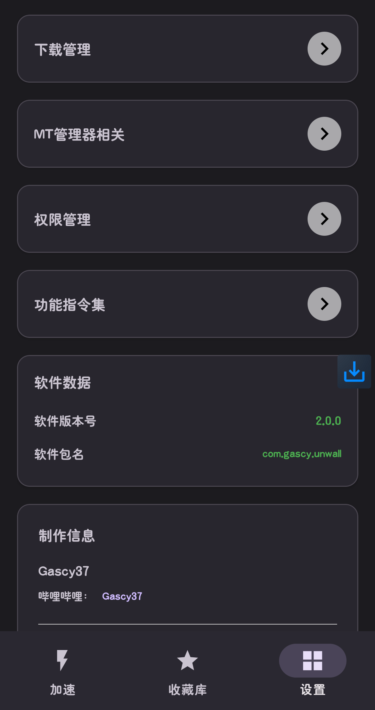

# unwall-app
打破限制，GitHub加速，B站/网易云一键直链，悬浮窗看进度。

# 星光拆墙 (Unwall)

**星光拆墙** 是一款 Android 下载辅助工具，专为解决国内访问 GitHub 慢、B站视频和网易云音乐下载繁琐等问题而生。  
它整合了多种解析服务，让你在一个 App 内完成**链接输入→解析→下载→文件管理**全流程。

<table style="width: 100%; table-layout: fixed;">
  <tr>
    <td style="width: 33%; padding: 8px;"></td>
    <td style="width: 33%; padding: 8px;"></td>
    <td style="width: 33%; padding: 8px;"></td>
  </tr>
</table>

## ✨ 主要功能

- 💢 在星光拆墙V1.6.0以上，在设置页里面的功能指令集，可以看到所有在通用下载页输入的指令。
- 📁 **自定义下载路径**：Android 10+ 使用 SAF 选择文件夹，旧版自动适配存储权限。
- ⬛ **悬浮窗进度显示**：下载时悬浮窗展开气泡，实时显示文件名和百分比。
- ⬜ **下载弹窗进度显示** : 下载时会显示下载弹窗，有进度条，有百分比，以及你自由开关是否显示当前下载实际文件大小和文件总大小。
- 🌐 **内置浏览器跳转** : 你可以使用访问内置浏览器来打开模糊路径并获取下载，不过目前为实验性。
- 🔧 **MT管理器联动**：下载完成后可直接用 MT 管理器打开文件，支持普通版/共存版切换。
- 💦 **功能指令集** : 你可以在设置的功能指令集界面看到所有的指令，在通用下载页输入指令即可对应功能。
- 🛡️ **权限一站式管理**：存储、所有文件访问、安装未知应用、悬浮窗权限快捷跳转。
- 📝 **本地日志记录**：下载异常自动写入日志，便于反馈问题，同时增加设置，可以一键清除所有日志，或者是将日志打包到根目录。

## 🛠️ 使用说明

1. **下载安装**：从 [Releases](https://github.com/Gascy37/unwall-app/releases) 下载 APK 并安装。
2. **收藏库相关**:从 [星光拆墙APP订阅源格式有分类版.yaml](./星光拆墙APP订阅源格式有分类版.yaml) 或 [星光拆墙APP订阅源格式无分类版.yaml](./星光拆墙APP订阅源格式无分类版.yaml) 可以写属于自己的订阅源。

## ⚙️ 技术栈

- 语言：Java
- 制作器: AndroidIDE换源版
- 网络：`HttpURLConnection` + 公共代理 / 解析 API
- 存储：SAF（`DocumentFile`）+ FileProvider
- UI：Material Design + Fragment + Navigation
- 日志：本地文件滚动记录

## ⚠️ 注意事项

- 本软件仅供个人学习交流，请勿用于商业或侵权用途。
- 解析服务由ctnBobong32开发者或第三方提供，稳定性不太确定。

## 🤝 贡献

欢迎提交 Issue 或 Pull Request。  

## 📧 联系作者

- Gascy37：B站 [Gascy37](https://space.bilibili.com/3546555082606623)
- ctnBobong32：B站 [@ctnBobong32](https://space.bilibili.com/1568237889)
